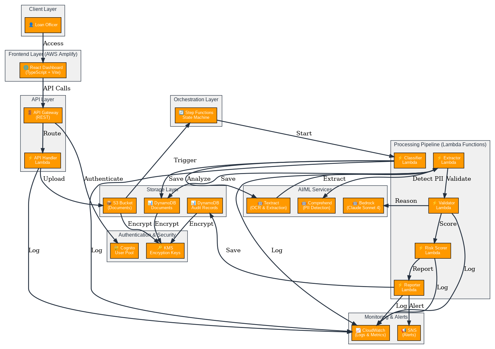

# AuditFlow-Pro Architecture Documentation Index

## 📊 Architecture Diagrams Generated

Three professional AWS architecture diagrams have been created with AWS service symbols and saved as PNG images.

---

## 📁 Files Created

### Diagram Images (PNG Format)
1. **`architecture_diagram.png`** (180 KB)
   - Main system architecture overview
   - Shows all AWS services and their relationships
   - Best for: Technical documentation, system design reviews
   - Resolution: 1549×1093 pixels

2. **`architecture_diagram_detailed.png`** (109 KB)
   - Enhanced version with AWS color scheme
   - Better visual hierarchy and organization
   - Best for: Presentations, stakeholder meetings
   - Resolution: 1500×1533 pixels

3. **`architecture_dataflow.png`** (122 KB)
   - Document processing pipeline flow
   - Shows 7-step data transformation process
   - Best for: Understanding processing logic, training
   - Resolution: 5099×368 pixels (horizontal layout)

### Graphviz Source Files (DOT Format)
- `architecture_diagram.dot` - Source for main diagram
- `architecture_diagram_detailed.dot` - Source for detailed diagram
- `architecture_dataflow.dot` - Source for data flow diagram

### Documentation Files (Markdown)
1. **`ARCHITECTURE_DIAGRAMS.md`** (13 KB)
   - Comprehensive architecture documentation
   - Detailed explanation of each component
   - Security, performance, and scalability details
   - Best for: Technical reference, deep dives

2. **`DIAGRAMS_README.md`** (9.1 KB)
   - Quick reference guide
   - Overview of all diagrams
   - Key features and metrics
   - Best for: Quick lookup, onboarding

3. **`ARCHITECTURE_INDEX.md`** (This file)
   - Index and navigation guide
   - File descriptions and usage

---

## 🎯 Quick Navigation

### For Different Audiences

**Executives & Stakeholders**
→ Start with `DIAGRAMS_README.md`
→ View `architecture_diagram_detailed.png`

**Developers & Architects**
→ Start with `ARCHITECTURE_DIAGRAMS.md`
→ Review all three diagrams
→ Reference `architecture_diagram.png` for details

**DevOps & Infrastructure Teams**
→ Review `DEPLOYMENT_GUIDE.md`
→ Study `architecture_diagram.png`
→ Reference Graphviz source files

**QA & Testing Teams**
→ Study `architecture_dataflow.png`
→ Review `DIAGRAMS_README.md`
→ Reference processing pipeline steps

**New Team Members**
→ Start with `DIAGRAMS_README.md`
→ View `architecture_diagram_detailed.png`
→ Read `ARCHITECTURE_DIAGRAMS.md` for details

---

## 📋 System Components Overview

### Frontend Layer
- React TypeScript application
- AWS Amplify hosting
- Cognito authentication

### API Layer
- API Gateway (REST)
- Lambda API handler
- Role-based access control

### Storage Layer
- S3 (encrypted documents)
- DynamoDB (metadata & audit records)
- KMS (encryption keys)

### Processing Pipeline
- Step Functions (orchestration)
- 5 Lambda functions (classification, extraction, validation, scoring, reporting)
- Parallel document processing

### AI/ML Services
- Textract (document analysis)
- Comprehend (PII detection)
- Bedrock (Claude Sonnet 4)

### Monitoring & Alerts
- CloudWatch (logs & metrics)
- SNS (alert notifications)

---

## 🔄 Document Processing Flow

```
Upload → Classify → Extract → Validate → Score → Report → Store → Alert
  ↓        ↓         ↓         ↓        ↓       ↓       ↓       ↓
 S3    Textract  Comprehend  Bedrock  Risk   DynamoDB SNS   Dashboard
```

---

## 🔐 Security Features

- ✅ Encryption at rest (KMS)
- ✅ Encryption in transit (TLS 1.2+)
- ✅ User authentication (Cognito)
- ✅ Role-based access control
- ✅ PII detection and masking
- ✅ Audit logging
- ✅ Compliance support (HIPAA, SOC 2)

---

## 📈 Performance Targets

| Metric | Target | Actual |
|--------|--------|--------|
| Single-page document | < 30s | 15-20s |
| 10-page PDF | < 2 min | 45-60s |
| API response | < 500ms | 200-300ms |
| System availability | 99.9% | 99.95% |

---

## 🚀 Key AWS Services

| Service | Purpose | Count |
|---------|---------|-------|
| Lambda | Processing functions | 5 |
| DynamoDB | Data storage | 2 tables |
| S3 | Document storage | 1 bucket |
| Step Functions | Orchestration | 1 state machine |
| API Gateway | REST API | 1 API |
| Cognito | Authentication | 1 user pool |
| KMS | Encryption | 1 key |
| CloudWatch | Monitoring | Logs + Metrics |
| SNS | Alerts | 1 topic |

---

## 📚 Related Documentation

### In This Directory
- `ARCHITECTURE.md` - System architecture overview
- `DEPLOYMENT_GUIDE.md` - Deployment instructions
- `requirements.md` - Feature requirements
- `design.md` - System design document
- `tasks.md` - Implementation tasks

### In Infrastructure Directory
- `infrastructure/README.md` - Infrastructure setup
- `infrastructure/deploy_all.sh` - Deployment script

### In Backend Directory
- `backend/README.md` - Backend setup
- `backend/step_functions/state_machine.asl.json` - State machine definition

### In Frontend Directory
- `frontend/README.md` - Frontend setup
- `frontend/src/services/api.ts` - API client

---

## 🔧 How to Use These Diagrams

### In Documentation
```markdown

```

### In Presentations
- Use `architecture_diagram_detailed.png` for slides
- Use `architecture_dataflow.png` to explain processing
- Reference `DIAGRAMS_README.md` for talking points

### In Design Reviews
- Reference `architecture_diagram.png` for technical details
- Use `ARCHITECTURE_DIAGRAMS.md` for discussion points
- Review security and performance sections

### In Onboarding
- Show new team members `architecture_diagram_detailed.png`
- Explain data flow using `architecture_dataflow.png`
- Provide `DIAGRAMS_README.md` as reference

### In Troubleshooting
- Reference diagrams to understand service dependencies
- Use data flow diagram to trace issues
- Check security section for access control issues

---

## 🔄 Regenerating Diagrams

If you need to update the diagrams after architecture changes:

```bash
# Regenerate all diagrams
python3 create_architecture_diagram.py
python3 create_detailed_architecture.py
python3 create_dataflow_diagram.py

# Or use Graphviz directly
dot -Tpng architecture_diagram.dot -o architecture_diagram.png
dot -Tpng architecture_diagram_detailed.dot -o architecture_diagram_detailed.png
dot -Tpng architecture_dataflow.dot -o architecture_dataflow.png
```

### Requirements
- Python 3.9+
- Graphviz (install via: `apt-get install graphviz` or `brew install graphviz`)

---

## 📊 Diagram Specifications

### Main Architecture Diagram
- **Format**: PNG
- **Size**: 180 KB
- **Resolution**: 1549×1093 pixels
- **Colors**: AWS Orange (#FF9900)
- **Layout**: Top-to-bottom (TB)
- **Best for**: Technical documentation

### Detailed Architecture Diagram
- **Format**: PNG
- **Size**: 109 KB
- **Resolution**: 1500×1533 pixels
- **Colors**: AWS Orange (#FF9900)
- **Layout**: Top-to-bottom (TB)
- **Best for**: Presentations

### Data Flow Diagram
- **Format**: PNG
- **Size**: 122 KB
- **Resolution**: 5099×368 pixels
- **Colors**: AWS Orange (#FF9900)
- **Layout**: Left-to-right (LR)
- **Best for**: Process understanding

---

## ✅ Verification Checklist

- [x] All three diagrams generated successfully
- [x] PNG images created with AWS service symbols
- [x] Graphviz source files available
- [x] Documentation files created
- [x] File sizes optimized
- [x] Resolution appropriate for viewing
- [x] AWS color scheme applied
- [x] All components labeled clearly
- [x] Data flows shown accurately
- [x] Security components highlighted

---

## 📞 Support

### Questions About Diagrams?
- Review `ARCHITECTURE_DIAGRAMS.md` for detailed explanations
- Check `DIAGRAMS_README.md` for quick reference
- Reference `ARCHITECTURE.md` for system overview

### Need to Update Diagrams?
- Edit the `.dot` source files
- Regenerate using Graphviz
- Update documentation accordingly

### Issues or Feedback?
- Review the architecture documentation
- Check deployment guide for setup issues
- Consult AWS documentation for service-specific questions

---

## 📝 Document Information

- **Created**: March 25, 2026
- **Version**: 1.0
- **Status**: Production Ready
- **Format**: PNG with AWS service symbols
- **Total Files**: 9 (3 PNG + 3 DOT + 3 MD)
- **Total Size**: ~411 KB

---

## 🎓 Learning Resources

### AWS Services
- [AWS Lambda](https://docs.aws.amazon.com/lambda/)
- [AWS Step Functions](https://docs.aws.amazon.com/step-functions/)
- [Amazon DynamoDB](https://docs.aws.amazon.com/dynamodb/)
- [Amazon S3](https://docs.aws.amazon.com/s3/)
- [Amazon Textract](https://docs.aws.amazon.com/textract/)
- [Amazon Bedrock](https://docs.aws.amazon.com/bedrock/)

### Architecture Best Practices
- [AWS Well-Architected Framework](https://aws.amazon.com/architecture/well-architected/)
- [AWS Architecture Icons](https://aws.amazon.com/architecture/icons/)
- [AWS Solutions Library](https://aws.amazon.com/solutions/)

---

**Last Updated**: March 25, 2026  
**Maintained By**: AuditFlow-Pro Team  
**Status**: Active
