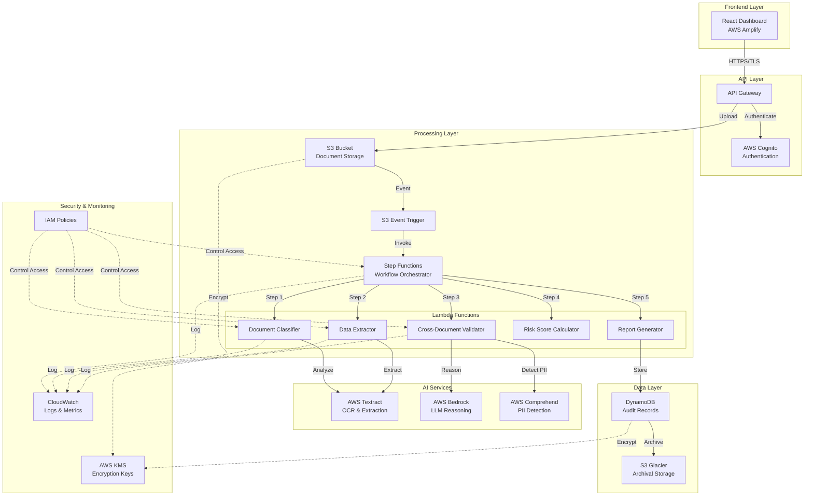

# Technical Design Document: AuditFlow-Pro Loan Document Auditor

## Overview

AuditFlow-Pro is a serverless, AI-powered loan document auditor built on AWS that automates the extraction, validation, and cross-referencing of data across multiple loan documents. The system processes W2s, bank statements, tax forms, driver's licenses, and identification documents to identify inconsistencies before human review, generating risk reports with confidence scores to accelerate loan approval workflows.

### System Goals

- Automate document classification and data extraction using AWS Textract
- Perform intelligent cross-document validation using AWS Bedrock for AI reasoning
- Detect and protect PII using AWS Comprehend
- Provide real-time audit results through a React-based dashboard
- Ensure banking-grade security with encryption at rest and in transit
- Scale automatically to handle variable document volumes
- Maintain comprehensive audit trails for compliance

### Technology Stack

- **Frontend**: React (TypeScript), hosted on AWS Amplify
- **Backend**: AWS Lambda (Python), Step Functions for orchestration
- **AI Services**: AWS Textract (OCR), Bedrock (LLM reasoning), Comprehend (PII detection)
- **Storage**: S3 (documents), DynamoDB (audit records)
- **Security**: Cognito (authentication), KMS (encryption), IAM (access control)
- **Monitoring**: CloudWatch (logging and metrics)
- **Deployment**: AWS CLI automation scripts

### High-Level Architecture

The system follows an event-driven serverless architecture:

1. Users upload documents through React dashboard
2. S3 event triggers initiate Lambda-based processing
3. Step Functions orchestrate multi-stage workflows
4. AI services extract and validate document data
5. Results stored in DynamoDB and displayed in dashboard


## Architecture

### System Architecture Diagram



### Architecture Principles

1. **Event-Driven Processing**: S3 upload events trigger automatic processing workflows
2. **Serverless Scalability**: Lambda functions scale automatically based on load
3. **Separation of Concerns**: Each Lambda function handles a single responsibility
4. **Idempotency**: All processing steps can be safely retried without side effects
5. **Security by Default**: Encryption at rest and in transit, least-privilege IAM policies
6. **Observability**: Comprehensive logging and monitoring at every layer


## Components and Interfaces

### Frontend Components

#### 1. React Dashboard (Amplify-Hosted)

**Responsibilities**:
- User authentication via Cognito
- Document upload interface with drag-and-drop
- Real-time audit queue display
- Detailed audit result viewer
- Document viewer with inconsistency highlighting

**Key Components**:
- `AuthProvider`: Manages Cognito authentication state
- `UploadZone`: Drag-and-drop file upload with validation
- `AuditQueue`: Displays pending and completed audits with sorting/filtering
- `AuditDetailView`: Shows extracted data, inconsistencies, and risk scores
- `DocumentViewer`: Embedded PDF/image viewer with annotation support
- `InconsistencyPanel`: Lists flagged issues with severity indicators

**API Integration**:
- REST API via API Gateway for document upload
- WebSocket or polling for real-time status updates
- S3 pre-signed URLs for secure document viewing

**State Management**:
- React Context for authentication state
- React Query for server state and caching
- Local state for UI interactions

---

### Backend Components

#### 2. Document Classifier Lambda

**Purpose**: Automatically identify document types from uploaded files

**Input**:
```python
{
    "document_id": "uuid",
    "s3_bucket": "bucket-name",
    "s3_key": "path/to/document.pdf"
}
```

**Output**:
```python
{
    "document_id": "uuid",
    "document_type": "W2" | "BANK_STATEMENT" | "TAX_FORM" | "DRIVERS_LICENSE" | "ID_DOCUMENT",
    "confidence": 0.95,
    "requires_manual_review": false
}
```

**Logic**:
1. Invoke Textract AnalyzeDocument API
2. Extract text and detect form structures
3. Apply classification rules:
   - W2: Detect IRS form structure, "Wage and Tax Statement", employer EIN
   - Bank Statement: Detect financial institution headers, transaction tables
   - Tax Form: Detect IRS form numbers (1040, 1099), tax year
   - Driver's License: Detect state DMV formats, license number patterns
   - ID Document: Detect government-issued ID characteristics
4. Return classification with confidence score
5. Flag for manual review if confidence < 70%

**Error Handling**:
- Retry Textract API calls with exponential backoff
- Handle illegible documents gracefully
- Log classification failures with document context

---

#### 3. Data Extractor Lambda

**Purpose**: Extract structured data from classified documents

**Input**:
```python
{
    "document_id": "uuid",
    "document_type": "W2",
    "s3_bucket": "bucket-name",
    "s3_key": "path/to/document.pdf",
    "page_count": 1
}
```

**Output**:
```python
{
    "document_id": "uuid",
    "extracted_data": {
        "name": {"value": "John Doe", "confidence": 0.98},
        "address": {"value": "123 Main St", "confidence": 0.95},
        "ssn": {"value": "***-**-1234", "confidence": 0.99},
        # Document-specific fields
    },
    "extraction_timestamp": "2024-01-15T10:30:00Z",
    "low_confidence_fields": ["address"]
}
```

**Extraction Schema by Document Type**:

**W2 Form**:
- employer_name, employer_ein, employee_name, employee_ssn
- wages, federal_tax_withheld, state_tax_withheld, tax_year

**Bank Statement**:
- account_holder_name, account_number, bank_name
- statement_period_start, statement_period_end, ending_balance

**Tax Form**:
- taxpayer_name, taxpayer_ssn, filing_status
- adjusted_gross_income, total_tax, tax_year

**Driver's License**:
- full_name, date_of_birth, license_number
- address, state, expiration_date, issue_date

**ID Document**:
- full_name, date_of_birth, document_number
- issuing_authority, expiration_date

**Logic**:
1. Invoke Textract AnalyzeDocument with FORMS and TABLES features
2. Parse key-value pairs and table data
3. Apply document-specific extraction patterns
4. Invoke Comprehend for PII detection
5. Calculate confidence scores for each field
6. Flag fields with confidence < 80% for manual verification
7. Handle multi-page PDFs by aggregating data across pages

**Error Handling**:
- Handle corrupted or illegible pages
- Timeout protection for large documents (5-minute limit)
- Partial extraction on page-level failures

---

#### 4. Cross-Document Validator Lambda

**Purpose**: Compare data across documents and identify inconsistencies

**Input**:
```python
{
    "loan_application_id": "uuid",
    "documents": [
        {"document_id": "uuid1", "document_type": "W2", "extracted_data": {...}},
        {"document_id": "uuid2", "document_type": "TAX_FORM", "extracted_data": {...}},
        # ... more documents
    ]
}
```

**Output**:
```python
{
    "loan_application_id": "uuid",
    "inconsistencies": [
        {
            "field": "name",
            "severity": "CRITICAL",
            "expected": "John Doe",
            "actual": "Jon Doe",
            "source_documents": ["uuid1", "uuid2"],
            "description": "Name spelling variation exceeds 2 characters"
        }
    ],
    "golden_record": {
        "name": "John Doe",
        "address": "123 Main St, City, ST 12345",
        "ssn": "***-**-1234",
        # ... consolidated data
    }
}
```

**Validation Rules**:

1. **Name Validation**:
   - Compare names across all documents
   - Use Levenshtein distance to detect spelling variations
   - Flag if edit distance > 2 characters
   - Use Bedrock for semantic matching (e.g., "Bob" vs "Robert")

2. **Address Validation**:
   - Parse addresses into components (street, city, state, ZIP)
   - Compare each component across documents
   - Flag mismatches in any component
   - Use Bedrock to handle format variations (e.g., "Street" vs "St")

3. **Income Validation**:
   - Compare W2 wages with tax form adjusted gross income
   - Flag discrepancies > 5%
   - Account for multiple W2s (sum wages)

4. **Date of Birth Validation**:
   - Compare DOB across all identification documents
   - Flag any mismatches (zero tolerance)

5. **SSN Validation**:
   - Compare SSN across all documents
   - Flag any discrepancies (zero tolerance)

**Golden Record Generation**:
- For each field, select the value from the most reliable source
- Reliability hierarchy: Government ID > Tax Forms > W2 > Bank Statements
- Use highest confidence value when sources have equal reliability

**Bedrock Integration**:
- Use Claude 3 for semantic reasoning
- Prompt: "Compare these data values and determine if they represent the same entity: {value1} vs {value2}"
- Handle abbreviations, formatting differences, and common variations

---

#### 5. Risk Score Calculator Lambda

**Purpose**: Calculate risk score based on detected inconsistencies

**Input**:
```python
{
    "loan_application_id": "uuid",
    "inconsistencies": [...],
    "documents": [...]
}
```

**Output**:
```python
{
    "loan_application_id": "uuid",
    "risk_score": 45,
    "risk_level": "MEDIUM",
    "contributing_factors": [
        {"factor": "name_inconsistency", "points": 15},
        {"factor": "low_confidence_extraction", "points": 10},
        # ...
    ]
}
```

**Scoring Algorithm**:

```python
risk_score = 0

# Inconsistency penalties
for inconsistency in inconsistencies:
    if inconsistency.field == "name":
        risk_score += 15
    elif inconsistency.field == "address":
        risk_score += 20
    elif inconsistency.field in ["ssn", "license_number"]:
        risk_score += 30
    elif inconsistency.field in ["income", "wages"]:
        if discrepancy_percentage > 10:
            risk_score += 25
        else:
            risk_score += 15

# Extraction quality penalties
for document in documents:
    low_confidence_count = count_fields_below_threshold(document, 0.80)
    risk_score += low_confidence_count * 10
    
    if document.has_illegible_pages:
        risk_score += 5

# Cap at 100
risk_score = min(risk_score, 100)

# Determine risk level
if risk_score >= 80:
    risk_level = "CRITICAL"
elif risk_score >= 50:
    risk_level = "HIGH"
elif risk_score >= 25:
    risk_level = "MEDIUM"
else:
    risk_level = "LOW"
```

---

#### 6. Report Generator Lambda

**Purpose**: Compile audit results and store in DynamoDB

**Input**:
```python
{
    "loan_application_id": "uuid",
    "documents": [...],
    "inconsistencies": [...],
    "golden_record": {...},
    "risk_score": 45,
    "risk_level": "MEDIUM"
}
```

**Output**:
```python
{
    "audit_record_id": "uuid",
    "status": "COMPLETED",
    "dynamodb_key": "LOAN#uuid"
}
```

**Logic**:
1. Compile complete audit record
2. Categorize inconsistencies by severity
3. Generate document page references for each inconsistency
4. Store audit record in DynamoDB
5. Update audit queue status
6. Trigger alerts if risk_score > 80

---

### Step Functions Workflow

**Workflow Name**: `LoanDocumentAuditWorkflow`

**States**:

1. **ClassifyDocument**: Invoke Document Classifier Lambda
2. **ExtractData**: Invoke Data Extractor Lambda
3. **CheckAllDocumentsProcessed**: Wait for all documents in loan application
4. **ValidateDocuments**: Invoke Cross-Document Validator Lambda
5. **CalculateRiskScore**: Invoke Risk Score Calculator Lambda
6. **GenerateReport**: Invoke Report Generator Lambda
7. **HandleError**: Error handling state with retry logic

**Retry Policy**:
- Max attempts: 3
- Backoff rate: 2.0
- Intervals: 5s, 15s, 45s

**Error Handling**:
- Catch all Lambda errors
- Log to CloudWatch
- Move to failed state after exhausting retries
- Send SNS notification to administrators


## Data Models

### Document Metadata

**DynamoDB Table**: `AuditFlow-Documents`

**Primary Key**: `document_id` (String, UUID)

**Attributes**:
```python
{
    "document_id": "uuid",
    "loan_application_id": "uuid",
    "s3_bucket": "auditflow-documents-prod",
    "s3_key": "loans/uuid/document.pdf",
    "upload_timestamp": "2024-01-15T10:30:00Z",
    "uploaded_by": "user@example.com",
    "file_name": "w2_2023.pdf",
    "file_size_bytes": 524288,
    "file_format": "PDF",
    "checksum": "sha256:abc123...",
    "document_type": "W2",
    "classification_confidence": 0.95,
    "processing_status": "COMPLETED" | "PROCESSING" | "FAILED" | "PENDING",
    "extracted_data": {
        "name": {"value": "John Doe", "confidence": 0.98},
        "address": {"value": "123 Main St", "confidence": 0.95},
        # ... document-specific fields
    },
    "extraction_timestamp": "2024-01-15T10:31:00Z",
    "page_count": 1,
    "low_confidence_fields": ["address"],
    "requires_manual_review": false,
    "pii_detected": ["ssn", "dob", "account_number"],
    "encryption_key_id": "arn:aws:kms:...",
    "ttl": 1735689600  # Unix timestamp for archival
}
```

**Indexes**:
- GSI: `loan_application_id-upload_timestamp-index` (for querying all documents in a loan)
- GSI: `processing_status-upload_timestamp-index` (for audit queue)

---

### Audit Record

**DynamoDB Table**: `AuditFlow-AuditRecords`

**Primary Key**: `audit_record_id` (String, UUID)

**Attributes**:
```python
{
    "audit_record_id": "uuid",
    "loan_application_id": "uuid",
    "applicant_name": "John Doe",
    "audit_timestamp": "2024-01-15T10:35:00Z",
    "processing_duration_seconds": 45,
    "status": "COMPLETED" | "IN_PROGRESS" | "FAILED",
    
    "documents": [
        {
            "document_id": "uuid1",
            "document_type": "W2",
            "file_name": "w2_2023.pdf"
        },
        {
            "document_id": "uuid2",
            "document_type": "TAX_FORM",
            "file_name": "1040_2023.pdf"
        }
    ],
    
    "golden_record": {
        "name": "John Doe",
        "address": "123 Main St, Springfield, IL 62701",
        "ssn": "***-**-1234",
        "date_of_birth": "1985-06-15",
        "employer": "Acme Corporation",
        "annual_income": 75000,
        "bank_account": "****1234"
    },
    
    "inconsistencies": [
        {
            "inconsistency_id": "uuid",
            "field": "name",
            "severity": "CRITICAL" | "HIGH" | "MEDIUM" | "LOW",
            "expected_value": "John Doe",
            "actual_value": "Jon Doe",
            "source_documents": ["uuid1", "uuid2"],
            "document_pages": [
                {"document_id": "uuid1", "page": 1},
                {"document_id": "uuid2", "page": 1}
            ],
            "description": "Name spelling variation exceeds 2 characters",
            "detected_by": "cross_document_validator"
        }
    ],
    
    "risk_score": 45,
    "risk_level": "MEDIUM",
    "risk_factors": [
        {"factor": "name_inconsistency", "points": 15, "description": "Name mismatch detected"},
        {"factor": "low_confidence_extraction", "points": 10, "description": "2 fields below 80% confidence"}
    ],
    
    "alerts_triggered": [
        {
            "alert_type": "HIGH_RISK",
            "timestamp": "2024-01-15T10:35:00Z",
            "notification_sent": true
        }
    ],
    
    "reviewed_by": null,  # Set when loan officer reviews
    "review_timestamp": null,
    "review_notes": null,
    
    "archived": false,
    "archive_timestamp": null,
    "ttl": 1735689600  # Unix timestamp for deletion (7 years)
}
```

**Indexes**:
- GSI: `loan_application_id-audit_timestamp-index`
- GSI: `risk_score-audit_timestamp-index` (for high-risk queue)
- GSI: `status-audit_timestamp-index` (for filtering by status)

---

### Extracted Data Schema by Document Type

#### W2 Form Schema
```python
{
    "document_type": "W2",
    "tax_year": {"value": "2023", "confidence": 0.99},
    "employer_name": {"value": "Acme Corporation", "confidence": 0.97},
    "employer_ein": {"value": "12-3456789", "confidence": 0.98},
    "employee_name": {"value": "John Doe", "confidence": 0.98},
    "employee_ssn": {"value": "***-**-1234", "confidence": 0.99},
    "employee_address": {"value": "123 Main St, Springfield, IL 62701", "confidence": 0.95},
    "wages": {"value": 75000.00, "confidence": 0.99},
    "federal_tax_withheld": {"value": 12000.00, "confidence": 0.98},
    "social_security_wages": {"value": 75000.00, "confidence": 0.99},
    "medicare_wages": {"value": 75000.00, "confidence": 0.99},
    "state": {"value": "IL", "confidence": 0.99},
    "state_tax_withheld": {"value": 3000.00, "confidence": 0.98}
}
```

#### Bank Statement Schema
```python
{
    "document_type": "BANK_STATEMENT",
    "bank_name": {"value": "First National Bank", "confidence": 0.98},
    "account_holder_name": {"value": "John Doe", "confidence": 0.97},
    "account_number": {"value": "****1234", "confidence": 0.99},
    "statement_period_start": {"value": "2023-12-01", "confidence": 0.99},
    "statement_period_end": {"value": "2023-12-31", "confidence": 0.99},
    "beginning_balance": {"value": 5000.00, "confidence": 0.98},
    "ending_balance": {"value": 6200.00, "confidence": 0.98},
    "total_deposits": {"value": 7500.00, "confidence": 0.97},
    "total_withdrawals": {"value": 6300.00, "confidence": 0.97},
    "account_holder_address": {"value": "123 Main St, Springfield, IL 62701", "confidence": 0.95}
}
```

#### Tax Form (1040) Schema
```python
{
    "document_type": "TAX_FORM",
    "form_type": {"value": "1040", "confidence": 0.99},
    "tax_year": {"value": "2023", "confidence": 0.99},
    "taxpayer_name": {"value": "John Doe", "confidence": 0.98},
    "taxpayer_ssn": {"value": "***-**-1234", "confidence": 0.99},
    "spouse_name": {"value": null, "confidence": null},
    "filing_status": {"value": "Single", "confidence": 0.98},
    "address": {"value": "123 Main St, Springfield, IL 62701", "confidence": 0.95},
    "wages_salaries": {"value": 75000.00, "confidence": 0.98},
    "adjusted_gross_income": {"value": 75000.00, "confidence": 0.98},
    "taxable_income": {"value": 62000.00, "confidence": 0.97},
    "total_tax": {"value": 9500.00, "confidence": 0.98},
    "federal_tax_withheld": {"value": 12000.00, "confidence": 0.98},
    "refund_amount": {"value": 2500.00, "confidence": 0.98}
}
```

#### Driver's License Schema
```python
{
    "document_type": "DRIVERS_LICENSE",
    "state": {"value": "IL", "confidence": 0.99},
    "license_number": {"value": "D123-4567-8901", "confidence": 0.98},
    "full_name": {"value": "John Doe", "confidence": 0.98},
    "date_of_birth": {"value": "1985-06-15", "confidence": 0.99},
    "address": {"value": "123 Main St, Springfield, IL 62701", "confidence": 0.95},
    "issue_date": {"value": "2020-06-15", "confidence": 0.97},
    "expiration_date": {"value": "2025-06-15", "confidence": 0.97},
    "sex": {"value": "M", "confidence": 0.99},
    "height": {"value": "5'10\"", "confidence": 0.95},
    "eye_color": {"value": "BRN", "confidence": 0.96}
}
```

#### ID Document Schema
```python
{
    "document_type": "ID_DOCUMENT",
    "id_type": {"value": "PASSPORT" | "STATE_ID" | "OTHER", "confidence": 0.95},
    "document_number": {"value": "123456789", "confidence": 0.98},
    "full_name": {"value": "John Doe", "confidence": 0.98},
    "date_of_birth": {"value": "1985-06-15", "confidence": 0.99},
    "issuing_authority": {"value": "U.S. Department of State", "confidence": 0.97},
    "issue_date": {"value": "2019-01-15", "confidence": 0.97},
    "expiration_date": {"value": "2029-01-15", "confidence": 0.97},
    "nationality": {"value": "USA", "confidence": 0.98}
}
```

---

### Golden Record Format

The Golden Record represents the authoritative, consolidated view of applicant data:

```python
{
    "loan_application_id": "uuid",
    "created_timestamp": "2024-01-15T10:35:00Z",
    
    # Personal Information
    "name": {
        "value": "John Doe",
        "source_document": "uuid_drivers_license",
        "confidence": 0.98,
        "alternative_values": ["Jon Doe"]
    },
    "date_of_birth": {
        "value": "1985-06-15",
        "source_document": "uuid_drivers_license",
        "confidence": 0.99
    },
    "ssn": {
        "value": "***-**-1234",
        "source_document": "uuid_tax_form",
        "confidence": 0.99
    },
    
    # Address Information
    "address": {
        "value": "123 Main St, Springfield, IL 62701",
        "source_document": "uuid_drivers_license",
        "confidence": 0.95,
        "alternative_values": ["123 Main Street, Springfield, IL 62701"]
    },
    
    # Employment Information
    "employer": {
        "value": "Acme Corporation",
        "source_document": "uuid_w2",
        "confidence": 0.97
    },
    "employer_ein": {
        "value": "12-3456789",
        "source_document": "uuid_w2",
        "confidence": 0.98
    },
    
    # Financial Information
    "annual_income": {
        "value": 75000.00,
        "source_document": "uuid_w2",
        "confidence": 0.99,
        "verified_by": ["uuid_tax_form"]
    },
    "bank_account": {
        "value": "****1234",
        "source_document": "uuid_bank_statement",
        "confidence": 0.99
    },
    "ending_balance": {
        "value": 6200.00,
        "source_document": "uuid_bank_statement",
        "confidence": 0.98
    },
    
    # Identification
    "drivers_license_number": {
        "value": "D123-4567-8901",
        "source_document": "uuid_drivers_license",
        "confidence": 0.98
    },
    "drivers_license_state": {
        "value": "IL",
        "source_document": "uuid_drivers_license",
        "confidence": 0.99
    }
}
```

---

### Risk Score Calculation Model

**Risk Score Range**: 0-100

**Risk Levels**:
- 0-24: LOW
- 25-49: MEDIUM
- 50-79: HIGH
- 80-100: CRITICAL

**Scoring Components**:

| Factor | Points | Condition |
|--------|--------|-----------|
| Name inconsistency | 15 | Edit distance > 2 characters |
| Address mismatch | 20 | Any component differs |
| Income discrepancy (5-10%) | 15 | Between W2 and tax form |
| Income discrepancy (>10%) | 25 | Between W2 and tax form |
| SSN mismatch | 30 | Any discrepancy |
| License number mismatch | 30 | Any discrepancy |
| Date of birth mismatch | 30 | Any discrepancy |
| Low confidence field | 10 | Per field < 80% confidence |
| Illegible page | 5 | Per page |
| Missing required document | 20 | Per document type |

**Example Calculation**:
```
Base score: 0
+ Name inconsistency: 15
+ Low confidence address: 10
+ Low confidence employer name: 10
= Total: 35 (MEDIUM risk)
```


## Correctness Properties

This section defines formal correctness properties that the AuditFlow-Pro system must satisfy. These properties are validated through property-based testing to ensure the system behaves correctly across all possible inputs.

### Property 1: Round-Trip Serialization Preserves Data

**Description**: For all valid document data objects, serializing to JSON and then deserializing back must produce an equivalent object.

**Formal Statement**:
```
∀ document_data ∈ ValidDocumentData:
  parse(pretty_print(document_data)) ≡ document_data
```

**Validates Requirements**: 23.4

**Test Strategy**:
- Generate random valid document data for each document type (W2, Bank Statement, Tax Form, Driver's License, ID Document)
- Serialize to JSON using pretty printer
- Parse JSON back to object
- Assert that parsed object equals original object
- Test with edge cases: empty fields, null values, special characters, maximum field lengths

**Implementation Location**: Task 2.2

**Failure Conditions**:
- Parsed object has different field values than original
- Parsing fails with valid serialized data
- Data loss during serialization (missing fields)
- Type conversion errors (e.g., float to string)

---

### Property 2: Golden Record Selection is Deterministic

**Description**: Given the same set of documents with the same extracted data, the Golden Record generation must always produce the same result.

**Formal Statement**:
```
∀ documents D, extracted_data E:
  generate_golden_record(D, E) = generate_golden_record(D, E)
```

**Validates Requirements**: 6.9

**Test Strategy**:
- Generate random sets of documents with extracted data
- Run Golden Record generation multiple times on the same input
- Assert that all runs produce identical Golden Records
- Test with various document combinations and reliability hierarchies
- Test with tied confidence scores (should use reliability hierarchy)
- Test with missing data in some documents

**Implementation Location**: Task 8.9

**Failure Conditions**:
- Different Golden Record values on repeated runs with same input
- Non-deterministic source document selection
- Random behavior in tie-breaking logic
- Inconsistent handling of missing data

---

### Property 3: Risk Score is Monotonically Increasing with Inconsistencies

**Description**: Adding more inconsistencies or decreasing data quality must never decrease the risk score.

**Formal Statement**:
```
∀ inconsistencies I₁, I₂ where I₁ ⊆ I₂:
  calculate_risk_score(I₁) ≤ calculate_risk_score(I₂)
```

**Validates Requirements**: 8.1, 8.2, 8.3, 8.4, 8.5

**Test Strategy**:
- Generate random inconsistency sets
- Calculate risk score for base set
- Add additional inconsistencies one at a time
- Assert that risk score never decreases
- Test with all inconsistency types (name, address, income, SSN, DOB)
- Test with low-confidence fields
- Test with illegible pages
- Verify score caps at 100

**Implementation Location**: Task 9.6

**Failure Conditions**:
- Risk score decreases when adding inconsistencies
- Risk score exceeds 100
- Negative risk scores
- Non-monotonic behavior with quality degradation

---

### Property 4: Document Classification is Consistent

**Description**: Classifying the same document multiple times must produce the same document type and similar confidence scores.

**Formal Statement**:
```
∀ document D:
  classify(D).document_type = classify(D).document_type ∧
  |classify(D).confidence - classify(D).confidence| < ε
```
where ε is a small tolerance for confidence score variation (e.g., 0.01)

**Validates Requirements**: 3.1, 3.8

**Test Strategy**:
- Upload the same document multiple times
- Run classification on each upload
- Assert that document_type is identical across all runs
- Assert that confidence scores are within tolerance
- Test with documents near classification boundaries
- Test with ambiguous documents

**Implementation Location**: Task 5.4

**Failure Conditions**:
- Different document types on repeated classification
- Large confidence score variations (> ε)
- Non-deterministic classification behavior

---

### Property 5: Data Extraction Confidence Bounds

**Description**: All extracted field confidence scores must be between 0 and 1 (inclusive), and fields flagged for manual review must have confidence below the threshold.

**Formal Statement**:
```
∀ extracted_data E, field f ∈ E:
  0 ≤ f.confidence ≤ 1 ∧
  (f.requires_manual_review ⟹ f.confidence < CONFIDENCE_THRESHOLD)
```

**Validates Requirements**: 4.8, 4.9

**Test Strategy**:
- Extract data from various documents
- Assert all confidence scores are in [0, 1] range
- Assert fields with confidence < 80% are flagged for manual review
- Test with high-quality and low-quality documents
- Test with partially illegible documents

**Implementation Location**: Task 6.10

**Failure Conditions**:
- Confidence scores outside [0, 1] range
- High-confidence fields flagged for manual review
- Low-confidence fields not flagged for manual review

---

### Property 6: Inconsistency Detection is Symmetric

**Description**: If document A is inconsistent with document B for a given field, then document B must be inconsistent with document A for the same field.

**Formal Statement**:
```
∀ documents A, B, field f:
  inconsistent(A.f, B.f) ⟺ inconsistent(B.f, A.f)
```

**Validates Requirements**: 6.2, 6.3, 6.4, 6.5, 6.6

**Test Strategy**:
- Generate pairs of documents with known inconsistencies
- Run validation in both directions (A vs B, B vs A)
- Assert that inconsistencies are detected in both directions
- Test with all field types (name, address, income, SSN, DOB)
- Test with semantic equivalence (e.g., "Street" vs "St")

**Implementation Location**: Task 8.10

**Failure Conditions**:
- Inconsistency detected in one direction but not the other
- Asymmetric validation logic
- Order-dependent inconsistency detection

---

### Property 7: Encryption Preserves Data Integrity

**Description**: Encrypting and then decrypting data must produce the original data without loss or corruption.

**Formal Statement**:
```
∀ data D:
  decrypt(encrypt(D)) = D
```

**Validates Requirements**: 16.1, 16.3, 16.4, 7.4

**Test Strategy**:
- Generate random data including PII fields
- Encrypt data using KMS
- Decrypt encrypted data
- Assert that decrypted data equals original data
- Test with various data types and sizes
- Test with special characters and unicode

**Implementation Location**: Task 23.7

**Failure Conditions**:
- Decrypted data differs from original
- Data corruption during encryption/decryption
- Loss of data during round-trip
- Encoding issues with special characters

---

### Property 8: Audit Record Completeness

**Description**: Every completed audit record must contain all required fields and reference all uploaded documents.

**Formal Statement**:
```
∀ audit_record R where R.status = "COMPLETED":
  R.loan_application_id ≠ null ∧
  R.risk_score ∈ [0, 100] ∧
  R.golden_record ≠ null ∧
  |R.documents| > 0 ∧
  ∀ doc ∈ R.documents: doc.extracted_data ≠ null
```

**Validates Requirements**: 12.2, 8.9, 9.1

**Test Strategy**:
- Complete audit workflows with various document sets
- Assert all required fields are present in audit record
- Assert all uploaded documents are referenced
- Assert risk score is in valid range
- Assert Golden Record is generated
- Test with minimum and maximum document counts

**Implementation Location**: Task 10.5

**Failure Conditions**:
- Missing required fields in completed audit record
- Null or empty Golden Record
- Risk score outside valid range
- Missing document references
- Incomplete extracted data

---

### Property 9: Processing Idempotency

**Description**: Processing the same document multiple times must produce the same audit results (idempotent operations).

**Formal Statement**:
```
∀ document D:
  process(D) = process(D)
```

**Validates Requirements**: 11.7

**Test Strategy**:
- Upload and process the same document multiple times
- Compare audit results across all processing runs
- Assert that extracted data, classifications, and risk scores are identical
- Test with various document types
- Test with workflow retries after failures

**Implementation Location**: Task 11.5

**Failure Conditions**:
- Different audit results on repeated processing
- Non-deterministic behavior in workflow
- State corruption from repeated processing
- Duplicate records created

---

### Property 10: Access Control Enforcement

**Description**: Users must only be able to access resources permitted by their role, and all unauthorized access attempts must be denied.

**Formal Statement**:
```
∀ user U, resource R:
  access(U, R) ⟹ authorized(U.role, R) ∧
  ¬authorized(U.role, R) ⟹ ¬access(U, R)
```

**Validates Requirements**: 2.4, 2.5, 17.1, 17.2, 17.3, 17.4

**Test Strategy**:
- Attempt to access resources with different user roles
- Assert Loan Officers can only access permitted operations
- Assert Administrators have full access
- Assert unauthorized access attempts are denied with proper error codes
- Test with expired sessions
- Test with invalid credentials

**Implementation Location**: Task 23.7

**Failure Conditions**:
- Unauthorized access succeeds
- Authorized access is denied
- Incorrect error codes for access violations
- Role-based restrictions not enforced

---

### Property 11: PII Masking Consistency

**Description**: PII must be consistently masked based on user role, and masked values must never reveal the original PII.

**Formal Statement**:
```
∀ user U with role "LOAN_OFFICER", pii_field F:
  display(F, U) ≠ F.original_value ∧
  ∀ user A with role "ADMINISTRATOR":
    display(F, A) = F.original_value
```

**Validates Requirements**: 7.5, 7.6

**Test Strategy**:
- Retrieve audit records with different user roles
- Assert SSN is masked for Loan Officers (first 5 digits hidden)
- Assert SSN is visible for Administrators
- Assert masked values don't reveal original data
- Test with various PII field types
- Verify PII access is logged

**Implementation Location**: Task 20.5

**Failure Conditions**:
- PII visible to unauthorized roles
- Inconsistent masking across requests
- Masked values reveal original data
- Administrator access not logged

---

### Property 12: Workflow State Consistency

**Description**: Step Functions workflow state must always be consistent, and interrupted workflows must resume from the correct state.

**Formal Statement**:
```
∀ workflow W, state S:
  interrupt(W, S) ⟹ resume(W) starts_at S ∧
  ∀ completed_state C: ¬re_execute(C)
```

**Validates Requirements**: 11.6, 11.7

**Test Strategy**:
- Start workflows and interrupt at various states
- Resume workflows and verify they continue from correct state
- Assert completed states are not re-executed
- Test with failures at each workflow stage
- Verify state data is preserved across interruptions

**Implementation Location**: Task 11.5

**Failure Conditions**:
- Workflow resumes from wrong state
- Completed states are re-executed
- State data is lost during interruption
- Workflow cannot resume after interruption

---

## Property-Based Testing Implementation Guide

### Test Framework
- Use **Hypothesis** (Python) for property-based testing of backend Lambda functions
- Use **fast-check** (TypeScript) for property-based testing of frontend React components
- Integrate property tests into CI/CD pipeline

### Test Data Generation
- Generate random valid document data for each document type
- Generate random inconsistencies with various severities
- Generate random user roles and permissions
- Use shrinking to find minimal failing examples

### Test Execution
- Run property tests with at least 100 examples per property
- Use deterministic random seeds for reproducibility
- Fail fast on first property violation
- Report minimal counterexamples for failures

### Coverage Goals
- All 12 correctness properties must have passing property-based tests
- Property tests must cover edge cases and boundary conditions
- Achieve 80%+ code coverage from property tests alone
